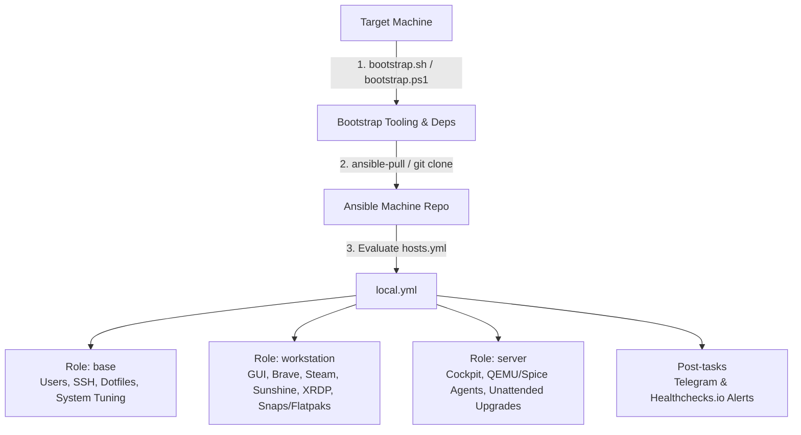

# Ansible Machine 💻

An automated infrastructure-as-code (IaC) and dotfiles repository to bootstrap, configure, and maintain Linux workstations, headless servers, Proxmox virtualization guests, macOS devices, and Windows environments using Ansible (`ansible-pull` / `ansible-playbook`) and standalone bootstrap scripts wihtin my homelab.

---

## 📑 Table of Contents

- [Overview & Architecture](#-overview--architecture)
- [Supported Platforms](#-supported-platforms)
- [Repository Structure](#-repository-structure)
- [Prerequisites](#-prerequisites)
- [1-Line Quick Start (Installers)](#-1-line-quick-start-installers)
  - [Linux (Full Setup)](#linux-full-setup)
  - [Linux (Dotfiles Only)](#linux-dotfiles-only)
  - [macOS](#macos)
  - [Windows (PowerShell)](#windows-powershell)
- [Manual Step-by-Step Installation](#-manual-step-by-step-installation)
  - [1. Inventory Configuration](#1-inventory-configuration)
  - [2. Run with `ansible-pull`](#2-run-with-ansible-pull)
  - [3. Run with `ansible-playbook`](#3-run-with-ansible-playbook)
- [Roles & Features](#-roles--features)
  - [1. Base Role (`roles/base`)](#1-base-role-rolesbase)
  - [2. Workstation Role (`roles/workstation`)](#2-workstation-role-rolesworkstation)
  - [3. Server Role (`roles/server`)](#3-server-role-rolesserver)
- [Useful Ansible Tags](#-useful-ansible-tags)
- [Alerts & Monitoring](#-alerts--monitoring)
- [Periodic Provisioning & Cron](#-periodic-provisioning--cron)
- [Troubleshooting & Distro Notes](#-troubleshooting--distro-notes)

---

## 🏗 Overview & Architecture

Ansible Machine provisions machines using a pull or push workflow:



- **Idempotent & Modular**: Each role encapsulates its own tasks, variables, files, and handlers.
- **Push or Pull Mode**: Ideal for local pull bootstrapping (`ansible-pull`) or centralized orchestrations (`ansible-playbook`).
- **Cross-Platform**: Configures Linux distributions (Ubuntu, Debian, Linux Mint), macOS (dotfiles/shell), and Windows (PowerShell profile & modular scripts).

---

## 🖥 Supported Platforms

| Platform / OS | Scope / Features | Execution Method |
| :--- | :--- | :--- |
| **Ubuntu / Debian / Linux Mint** | Full system provisioning (Base + Workstation or Base + Server) | `bootstrap.sh`, `ansible-pull`, or `ansible-playbook` |
| **macOS (Darwin)** | Dotfiles, Zsh configuration & plugins, Vim bundles, newsyslog | `bootstrap.sh -m` or `ansible-pull --tags mac` |
| **Windows 10/11** | Modular PowerShell profile, custom aliases, utilities, prompt | `bootstrap.ps1` or `roles/base/tasks/software/windows_dotfiles.yml` |
| **Proxmox VMs / Guests** | Headless server packages, QEMU Guest Agent, SPICE VDagent | `ansible-pull` or `ansible-playbook` |

---

## 📂 Repository Structure

```text
ansible-machine/
├── ansible.cfg              # Default Ansible configuration (inventory, logging, pipelining)
├── hosts.yml                # Inventory defining host groups and host variables
├── local.yml                # Main playbook entry point orchestrating roles and plays
├── bootstrap.sh             # Interactive / automated Bash bootstrap script (Linux & macOS)
├── bootstrap.ps1            # Standalone PowerShell bootstrap script (Windows)
├── agent.json               # Agent workspace metadata
├── collections/
│   └── requirements.yml     # Galaxy dependencies (ansible.posix, community.general)
├── group_vars/
│   └── all.yml              # Global variables (Telegram bot tokens, Healthchecks UUIDs)
├── playbooks/
│   ├── send_completion_alert.yml  # Telegram & Healthchecks.io success notifications
│   └── send_failure_alert.yml     # Telegram failure notifications with task details
└── roles/
    ├── base/                # Core system settings, users, dotfiles, base packages
    ├── workstation/         # GUI applications, desktop environments, gaming, streaming
    └── server/              # Server management, virtualization agents, unattended upgrades
```

---

## 📋 Prerequisites

Before running the installers or playbooks on Debian / Ubuntu / Linux Mint systems:

```bash
# Update package cache and install core prerequisites
sudo apt update && sudo apt install -y zsh curl git pipx python3-passlib

# (Optional) Install Oh My Zsh
sh -c "$(curl -fsSL https://raw.githubusercontent.com/ohmyzsh/ohmyzsh/master/tools/install.sh)"

# Install Ansible via pipx and inject passlib
pipx install --include-deps ansible
pipx ensurepath
pipx inject ansible passlib
source ~/.zshrc  # or source ~/.bashrc
```

> [!NOTE]
> On newer Ubuntu releases (e.g. 24.04 / 26.04+), if sudo alternatives need to be set to classic binaries:
> ```bash
> sudo update-alternatives --set sudo /usr/bin/sudo.ws
> ```

---

## ⚡ 1-Line Quick Start (Installers)

### Linux (Full Setup)

Downloads and executes `bootstrap.sh` to install dependencies, ensure your hostname is defined in[`hosts.yml`](./hosts.yml), set up collections, and run `ansible-pull`:

```bash
curl -fsSL https://raw.githubusercontent.com/brootware/ansible-machine/refs/heads/main/bootstrap.sh -o bootstrap.sh && chmod +x bootstrap.sh
./bootstrap.sh
```

### Linux (Dotfiles Only)

Applies only shell dotfiles (Zsh, Bash, Vim, Tmux, Git) for a specified user without modifying system users or packages:

```bash
./bootstrap.sh -d
```

### macOS

Bootstraps shell dotfiles and configurations tailored for macOS:

```bash
./bootstrap.sh -m
```

### Windows (PowerShell)

Installs the modular PowerShell profile, aliases, environment helpers, and custom prompt directly into your `Documents\WindowsPowerShell`:

```powershell
irm https://raw.githubusercontent.com/brootware/ansible-machine/refs/heads/main/bootstrap.ps1 | iex
```

---

## 🛠 Manual Step-by-Step Installation

### 1. Inventory Configuration

Set sudo password and ansible galaxy requirements

```bash
# Set root password (required if using the su become method)
sudo passwd root

# Install required Ansible Galaxy collections
ansible-galaxy collection install ansible.posix community.general
```

Ensure your machine's hostname (`hostname` or `hostname -f`) is registered in [`hosts.yml`](hosts.yml) under the appropriate group:

```yaml
workstation:
  hosts:
    minty.bruteware.cc: {}
    buntu:
      gnome: true
      ansible_become_method: su
    IdeaPad-Flex-5-14ALC05:
      gnome: true
      ansible_become_method: su
    macbookm2:
      mac: true

server:
  hosts:
    mediabox.bruteware.cc: {}
    gitrunner.bruteware.cc: {}

proxmoxhosts:
  hosts:
    10.0.0.12:
      proxmox_instance: true
```

### 2. Run with `ansible-pull`

Execute the playbook locally using `ansible-pull`:

```bash
# Full provision (prompts for become/root password and brootware user password)
ansible-pull -U https://github.com/brootware/ansible-machine.git -K -e "user_passwd=$(read -sp 'Enter password: ' p && echo $p)"

# Dotfiles only
ansible-pull -U https://github.com/brootware/ansible-machine.git -K --tags "onlydotfiles" -e "target_username=$(whoami) target_group=$(id -gn) target_user_home=$HOME"

# macOS only
ansible-pull -U https://github.com/brootware/ansible-machine.git -K --tags "mac" -vv
```

### 3. Run with `ansible-playbook`

If running against local or remote hosts from a cloned repository:

```bash
# Run locally on current machine
ansible-playbook -i hosts.yml local.yml -K -e "user_passwd=yourpassword"

# Run for a specific host group (e.g. workstations)
ansible-playbook -i hosts.yml local.yml --limit workstation -K
```

---

## 📦 Roles & Features

### 1. Base Role (`roles/base`)
The foundation applied to all Linux hosts:
- **User & Access Management**: Configures `brootware`, `root`, and `goodegg` accounts, sudoers entries (`/etc/sudoers.d/`), and SSH authorized keys (`ed25519` / `rsa`).
- **SSH Hardening**: Deploys a hardened `sshd_config` template and `/etc/issue.net` banner.
- **Dotfiles & Shell**: Installs managed configurations for **Bash**, **Zsh** (modular configs, themes, plugins), **Vim** (Pathogen, color schemes, Syntastic, NERDTree, CtrlP), **Tmux** (Continuum, Resurrect), **Git**, **Htop**, and **MC**.
- **System Tuning**:
  - `earlyoom` daemon installation and activation for low-memory protection.
  - Swappiness optimization (`vm.swappiness = 5`).
  - Automatic microcode updates (Intel / AMD).
  - Time synchronization via `systemd-timesyncd` and timezone setting (`Asia/Singapore`).
  - Systemd Journal log retention policy (`MaxFileSec=5day`).
  - Locale generation (`en_US.UTF-8`).
- **Package Management**:
  - Utilities: `curl`, `htop`, `iotop`, `lsof`, `mc`, `mosh`, `ncdu`, `nmap`, `ranger`, `rsync`, `screen`, `sshfs`, `tmux`, `fastfetch`/`neofetch`, `vim-nox`, `zsh`.
  - Development tools: `git`, `tig`, `fabric`, `flake8`, `python3`, `python3-pip`, `python3-virtualenv`, `ruby`, `rake`.
  - Cleanup: Removes unnecessary packages like `nano`, `cowsay`, `exim4`.

### 2. Workstation Role (`roles/workstation`)
Designed for desktop workstations:
- **Desktop Environments**:
  - **GNOME**: Nautilus file manager enhancements (list view, tree view, single-click to launch, permanent delete option).
  - **MATE / Cinnamon**: Appearance and session integration.
- **Applications & Streaming**:
  - **Brave Browser**: GPG key, repository setup, and Wayland touchpad gesture flags.
  - **Steam Gaming**: Multiarch `i386` activation, license acceptance, `steam-devices`, and Mesa Vulkan drivers (`mesa-vulkan-drivers`).
  - **Sunshine**: Game streaming server package installation and systemd user service setup.
  - **XRDP Remote Desktop**: Remote desktop server configured for Cinnamon/Xsessions + UFW port 3389 allow.
- **App Distribution**:
  - **Snaps (Ubuntu)**: VS Code, Telegram Desktop, Signal Desktop, Foliate.
  - **Flatpaks (Linux Mint)**: Signal, Déjà Dup, Telegram, Flatseal, Foliate, Sunshine.
- **User Configs**: `bpytop.conf`, SSH client configuration.

### 3. Server Role (`roles/server`)
Designed for headless infrastructure and Proxmox VMs:
- **Management Console**: Installs and starts **Cockpit** (`cockpit`) on port 9090.
- **Proxmox Virtualization Guests**: Installs and enables `qemu-guest-agent` and `spice-vdagent` when `proxmox_instance: true`.
- **Security & Maintenance**: Automated system security updates via `unattended-upgrades` and optional UFW firewall policies.

---

## 🏷 Useful Ansible Tags

Run specific parts of the configuration using `--tags` or skip using `--skip-tags`:

| Tag | Purpose / Target |
| :--- | :--- |
| `base` | Run all base system tasks and configurations |
| `workstation` | Run workstation-specific apps, desktop configs, and games |
| `server` | Run server management and virtualization tasks |
| `onlydotfiles` | Deploy user dotfiles (Zsh, Vim, Tmux, Bash, Git) without altering system packages |
| `mac` | Deploy macOS-compatible dotfiles and configurations |
| `windows` / `powershell` | Deploy Windows PowerShell dotfiles and profile scripts |
| `users` / `brootware` / `goodegg` | Configure user accounts, groups, and SSH keys |
| `ssh` / `openssh` | Configure SSH server daemon and client settings |
| `cron` | Configure periodic automated Ansible cron jobs |
| `packages` | Install or update system utilities and development packages |
| `steam` / `gaming` | Install Steam, 32-bit libraries, and Vulkan drivers |
| `gnome` / `nautilus` | Apply GNOME and Nautilus desktop preferences |

---

## 🔔 Alerts & Monitoring

Ansible Machine includes built-in reporting hooks in [`playbooks/send_completion_alert.yml`](playbooks/send_completion_alert.yml) and [`playbooks/send_failure_alert.yml`](playbooks/send_failure_alert.yml):

1. **Telegram Alerts**:
   - Sends a success notification upon completion.
   - Sends a detailed error report on failure including failed task name, action, and JSON error response.
2. **Healthchecks.io Ping**:
   - Pings a Healthchecks.io endpoint to confirm scheduled cron jobs completed successfully.

Configure your credentials in [`group_vars/all.yml`](group_vars/all.yml):

```yaml
telegram_chat_id: "YOUR_TELEGRAM_CHAT_ID"
telegram_token: "YOUR_TELEGRAM_BOT_TOKEN"
healthcheck_uuid: "YOUR_HEALTHCHECKS_IO_UUID"
```

---

## ⏱ Periodic Provisioning & Cron

When the `base` role runs, it renders a standalone runner script to `/usr/local/bin/provision` (from [`provision.sh.j2`](roles/base/templates/provision.sh.j2)) and configures a cron job:

- **Schedule**: Executes `/usr/local/bin/provision` every 30 minutes.
- **Power Management Inhibition**: Uses `systemd-inhibit` to prevent sleep or system disruption during an active run.
- **Reboot Refresh**: Clears `~/.ansible` cache on boot.

---

## 💡 Troubleshooting & Distro Notes

- **Password Prompts**:
  - `ansible-pull -K` prompts for the `sudo` / `su` become password.
  - `-e "user_passwd=..."` provides the cleartext password that is SHA-512 hashed by Ansible for user creation.
- **Passlib Error on Modern Ubuntu/Debian**:
  - If you encounter `passlib is required` errors, install `python3-passlib` and run `pipx inject ansible passlib`.
- **Root Password for `su` Become Method**:
  - Some hosts in [`hosts.yml`](hosts.yml) use `ansible_become_method: su`. Ensure a root password is set (`sudo passwd root`).
- **Brave Browser Touchpad Gestures**:
  - The workstation role configures Wayland flags (`--ozone-platform=wayland --enable-features=TouchpadOverscrollHistoryNavigation`) for smooth 2-finger navigation.
